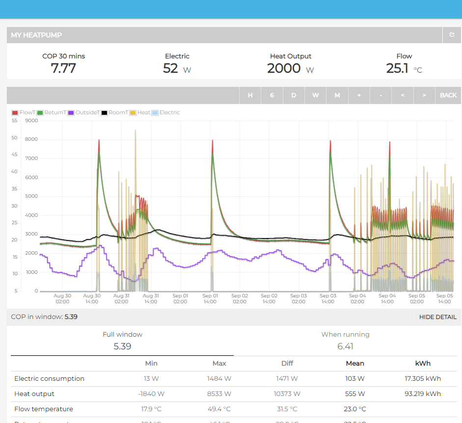

# Scraping of heatpumpmonitor.org
Scraping of https://heatpumpmonitor.org/ website for pulling out real heat pump data.



### Directory structure
```
heatpumpmonitoring_scraping
│   README.md
|   LICENSE
|   src
|   │   api.py  (API for scraping data)
|   │   scraping.py  (Scraping functions for obtaining the API key of a specific heat pump)
|   │   utils.py  (Utility functions for data handling)
|   |   fetch.py (Fetching functions for obtaining the data)
|   |   main.py (Main script for running the scraping)
│   requirements.txt
│   .gitignore
```
The procedure for scraping the data is as follows:
1. Extract the IDs of all the heat pumps from the website.
2. For each heat pump, extract the API key and the url of the MyHeatPump App through scraping of the web page of the specific heat pump.
3. Use the API key and the url to obtain the timeseries data from the APIs. Since there is a limit of the bytes that can be queried, the overall process is divided for each month and each 5 variables.

To run everything, you can use the main.py script. The script will scrape the data for all the heat pumps that have an associated API Key and save it in a csv file for the timeseries, and in a json file for the metadata associated to each variable.

### Project initialization and setup
- Clone the project from the repository:
    ```bash
  git clone https://github.com/Giudice7/heatpumpmonitoring_scraping.git
    ```

- Open the terminal and move to the project folder.
    ```bash
  cd heatpumpmonitoring_scraping
    ```

- Check the python version installed:
    ```bash
  python --version
    ```

    In this project, Python 3.11 was used, so it is recommended to use the same version to avoid compilation problems. If you have a different version, download the 3.11 from the following [link](https://www.python.org/downloads/release/python-3110/).

- Create a virtual environment (venv) in the project folder:
    ```bash
    python -m venv venv
    ```
- Activate the virtual environment:
    ```bash
    venv/Scripts/activate
    ```
- Install dependencies:
    ```bash
    pip install -r requirements.txt
    ```
  
### Contributor
- [Rocco Giudice](http://www.baeda.polito.it/people/members/giudice_rocco)